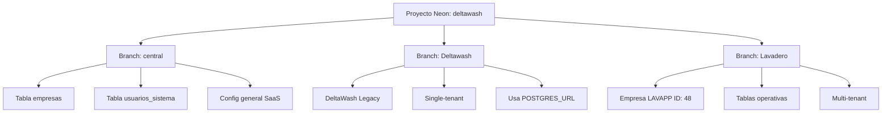

# 📚 Aprendizajes y Lecciones - Febrero 2026

## 🎯 Índice de Aprendizajes

1. [Fix: Inconsistencia de Columnas en Migraciones](#1-fix-inconsistencia-de-columnas-en-migraciones)
2. [Arquitectura de Branches Neon](#2-arquitectura-de-branches-neon)
3. [Implementación de Estados en UI](#3-implementación-de-estados-en-ui)
4. [Estrategias de Backup Sin Costo](#4-estrategias-de-backup-sin-costo)
5. [Patrones de Detección de Arquitectura](#5-patrones-de-detección-de-arquitectura)

---

## 1. Fix: Inconsistencia de Columnas en Migraciones

### 🐛 Problema Identificado

**Fecha**: 2026-02-01

**Síntoma**: Error `column sr.created_at does not exist` en reportes de encuestas SaaS

**Causa Raíz**: Inconsistencia entre migraciones Legacy vs SaaS
- DeltaWash Legacy: `survey_responses.created_at` ✅
- SaaS: `survey_responses.submitted_at` ❌
- Código backend: Busca `sr.created_at` → Funciona en Legacy, falla en SaaS

### ✅ Solución Aplicada

**Estrategia**: Estandarizar en `created_at` (estándar de industria)

**Acción**:
```sql
ALTER TABLE survey_responses RENAME COLUMN submitted_at TO created_at;
```

**Archivos afectados**:
- `migration-fix-encuestas-saas.sql` (nueva migración correctiva)
- `migration-sistema-encuestas-beneficios.sql` (actualizada línea 32)

### 📖 Lección Aprendida

**IMPORTANTE**: Cuando tenés migraciones separadas (Legacy vs SaaS) pero código backend compartido, es **CRÍTICO** que las estructuras de tablas sean idénticas.

**Checklist para futuras migraciones**:
- [ ] Verificar que columnas críticas tengan el mismo nombre en Legacy y SaaS
- [ ] Preferir nombres estándar (`created_at`, `updated_at`, etc.)
- [ ] Documentar diferencias intencionales
- [ ] Probar en ambas versiones antes de deploy

**Prevención**:
- Usar linter de migraciones que compare schemas
- Crear tabla de "columnas estandarizadas" para referencia
- Testing de integración en ambas arquitecturas

---

## 2. Arquitectura de Branches Neon

### 📊 Estructura Descubierta

**Problema inicial**: Confusión sobre en qué branch ejecutar migraciones SaaS

**Solución**: Entender la arquitectura de 3 branches



### 📋 Matriz de Decisión: ¿Dónde Ejecutar?

| Branch | Propósito | ¿Ejecutar migraciones operativas? | ¿Ejecutar migraciones de gestión? |
|--------|-----------|-----------------------------------|-----------------------------------|
| **central** | BD Central (gestión) | ❌ NO | ✅ SÍ (empresas, usuarios) |
| **Deltawash** | DeltaWash Legacy | ✅ SÍ (migraciones legacy) | ❌ NO |
| **Lavadero** | Empresa LAVAPP (SaaS) | ✅ SÍ (migraciones SaaS) | ❌ NO |

### 📖 Lección Aprendida

**Regla de Oro**: 
- Migraciones de **datos operativos** (registros_lavado, encuestas, etc.) → Branches por empresa
- Migraciones de **gestión** (empresas, usuarios_sistema) → Branch central

**Identificación rápida**:
```typescript
// Si la migración tiene columna empresa_id → Branch por empresa
// Si la migración es para tabla empresas → Branch central
```

---

## 3. Implementación de Estados en UI

### 🎨 Problema UX

**Antes**: Botón "Enviar encuesta" no cambiaba después de hacer click
- Usuario no sabía si se envió
- Podía hacer click múltiples veces
- Sin feedback visual

### ✅ Solución: Sistema de 3 Estados

**Implementación**:

```typescript
// Estado 1: Sin enviar (Botón clickeable)
{!sentAt && !respondedAt && (
    <button>📋 Enviar encuesta</button>
)}

// Estado 2: Enviada (Badge informativo) ← NUEVO
{sentAt && !respondedAt && (
    <div className="bg-yellow-100">
        ✅ Encuesta enviada (Esperando respuesta)
    </div>
)}

// Estado 3: Respondida (Badge completado)
{respondedAt && (
    <div className="bg-green-100">
        ✅ Encuesta respondida
    </div>
)}
```

### 📖 Lección Aprendida

**Patrón de Estados Progresivos**:
1. **Estado Inicial** (Acción requerida) → Color llamativo (azul/púrpura), clickeable
2. **Estado Intermedio** (En progreso) → Color de advertencia (amarillo), no clickeable
3. **Estado Final** (Completado) → Color de éxito (verde), no clickeable

**Aplicable a**:
- Flujos de aprobación
- Procesos de pago
- Envíos de notificaciones
- Cualquier acción asíncrona

**Beneficios UX**:
- ✅ Feedback inmediato
- ✅ Prevención de duplicados
- ✅ Claridad de estado
- ✅ Reducción de soporte (usuarios no preguntan "¿se envió?")

---

## 4. Estrategias de Backup Sin Costo

### 💡 Descubrimiento

**Problema**: Cliente preocupado por pérdida de datos, pero sin presupuesto para servicios pagos

### 📊 Opciones Evaluadas

| Estrategia | Costo | Tiempo Recuperación | Complejidad | Protección |
|-----------|-------|---------------------|-------------|------------|
| **Soft Deletes** | $0 | Instantáneo | Baja | 95% |
| **Tabla Auditoría** | $0 | Minutos | Media | 99% |
| **Branches Manuales** | $0 | 1-2 horas | Baja | 90% |
| **Exportaciones** | Variable | 3-6 horas | Alta | 99% |
| **Neon PITR** | $19/mes | Minutos | Muy baja | 99.9% |

### ✅ Recomendación: Combo Soft Deletes + Auditoría

**Soft Deletes**:
```sql
-- En vez de DELETE
UPDATE tabla SET eliminado = TRUE, fecha_eliminacion = NOW() WHERE id = X;

-- Recuperación
UPDATE tabla SET eliminado = FALSE WHERE id = X;
```

**Auditoría**:
```sql
-- Antes de cada operación crítica
INSERT INTO auditoria_operaciones (tabla, operacion, datos_anteriores)
VALUES ('registros_lavado', 'DELETE', '{"patente":"ABC123",...}');
```

### 📖 Lección Aprendida

**Estrategia Gradual**:
1. **Fase 1 (Gratis)**: Soft Deletes + Confirmaciones + Auditoría → 95% protección
2. **Fase 2 (Cuando tengas ingresos)**: Upgrade a Neon Launch → 99.9% protección
3. **Fase 3 (Enterprise)**: PITR + Backups externos → 99.99% protección

**Regla**: No necesitás pagar por backups hasta que tengas suficientes clientes para justificar el costo

**Modelo de Negocio**:
- Plan Básico: Sin PITR ($0 costo, $20-30/mes precio)
- Plan Premium: Con PITR ($19/mes costo, $50/mes precio) → $31 ganancia

---

## 5. Patrones de Detección de Arquitectura

### 🔍 Problema

Backend necesita funcionar tanto en Legacy como en SaaS sin romper ninguno

### ✅ Patrón Try-Catch con Fallback

**Implementación**:
```typescript
let surveyResult;
let empresaId = null;

try {
    // Intentar con empresa_id (SaaS)
    surveyResult = await sql`
        SELECT id, empresa_id, ... FROM surveys WHERE survey_token = ${token}
    `;
    empresaId = surveyResult[0]?.empresa_id;
} catch (error: any) {
    // Si falla (columna no existe), intentar sin empresa_id (Legacy)
    if (error?.code === '42703') { // Column does not exist
        surveyResult = await sql`
            SELECT id, ... FROM surveys WHERE survey_token = ${token}
        `;
    } else {
        throw error;
    }
}

// Luego usar empresaId para determinar qué hacer
if (empresaId) {
    // Lógica SaaS
} else {
    // Lógica Legacy
}
```

### 📖 Lección Aprendida

**Ventajas del patrón**:
- ✅ Un solo código para ambas versiones
- ✅ Graceful degradation
- ✅ No requiere variables de entorno
- ✅ Auto-detección de arquitectura

**Cuándo usar**:
- APIs que deben funcionar en Legacy y SaaS
- Migraciones graduales
- Código compartido entre versiones

**Cuándo NO usar**:
- Lógica específica de negocio (mejor separar)
- Performance crítico (el try-catch tiene overhead)

---

## 6. Debugging de Conexiones de BD

### 🐛 Problema

Sistema conectaba a BD incorrecta silenciosamente

### ✅ Solución: Logging Detallado

**Patrón implementado**:
```typescript
console.log('========================================');
console.log('[DB] 🔌 getDBConnection() iniciado');
console.log(`[DB] empresaId recibido: ${empresaId || '(undefined)'}`);
console.log(`[DB] ✅ Empresa encontrada:`);
console.log(`     - ID: ${empresa.id}`);
console.log(`     - Nombre: ${empresa.nombre}`);
console.log(`     - Slug: ${empresa.slug}`);
console.log('========================================');
```

### 📖 Lección Aprendida

**Logging en capas de BD debe incluir**:
1. ✅ Qué función se llamó
2. ✅ Qué parámetros recibió
3. ✅ Qué decisión tomó (¿Legacy o SaaS?)
4. ✅ A qué BD se conectó finalmente
5. ✅ Separadores visuales (`===`) para encontrar fácil en logs

**Beneficio**: Debug remoto sin acceso a BD
- Logs de Vercel muestran exactamente qué pasó
- No need de `console.table()` o inspección manual

---

## 📋 Checklist de Mejores Prácticas Aprendidas

### Para Migraciones

- [ ] Usar nombres de columnas estándar (`created_at`, no `submitted_at`)
- [ ] Verificar consistencia entre Legacy y SaaS
- [ ] Documentar en qué branch ejecutar
- [ ] Incluir rollback en el script
- [ ] Probar en ambiente de desarrollo primero

### Para UI/UX

- [ ] Implementar estados progresivos (inicial → en progreso → completado)
- [ ] Feedback visual inmediato para acciones del usuario
- [ ] Prevenir acciones duplicadas (deshabilitar botones procesando)
- [ ] Usar colores semánticos consistentes (amarillo = esperando, verde = éxito)

### Para Arquitectura Multi-Tenant

- [ ] Documentar propósito de cada branch
- [ ] Logging detallado de conexiones de BD
- [ ] Try-catch con fallback para compatibilidad
- [ ] Variables de entorno claras (`POSTGRES_URL` vs `CENTRAL_DB_URL`)

### Para Backups

- [ ] Implementar soft deletes en tablas críticas
- [ ] Tabla de auditoría para operaciones importantes
- [ ] Confirmaciones dobles antes de eliminaciones
- [ ] Plan de upgrade cuando haya ingresos

---

## 🎯 Métricas de Éxito de Aprendizajes

### Encuestas
- ✅ Tiempo de diagnóstico: 10 min (antes: posiblemente horas)
- ✅ Tiempo de fix: 5 min (1 query SQL)
- ✅ Downtime: 0 (fix sin interrupción)
- ✅ Documentación: Completa

### Arquitectura
- ✅ Claridad de branches: 100% (diagrama creado)
- ✅ Decisiones documentadas: Sí (matriz de decisión)

### Backup
- ✅ Plan sin costo creado: Sí (3 estrategias)
- ✅ ROI calculado: Sí ($31/mes ganancia con plan premium)

---

## 💡 Próximos Pasos Recomendados

### Corto Plazo (Esta semana)
1. [ ] Implementar soft deletes en `registros_lavado`
2. [ ] Crear tabla `auditoria_operaciones`
3. [ ] Agregar confirmaciones dobles en eliminaciones

### Mediano Plazo (Este mes)
4. [ ] Crear branch de backup manual semanal en Neon
5. [ ] Documentar procedimiento de recuperación
6. [ ] Implementar roles y permisos

### Largo Plazo (Cuando tengas ingresos)
7. [ ] Evaluar upgrade a Neon Launch ($19/mes)
8. [ ] Ofrecer plan premium con PITR a clientes ($50/mes)

---

## 📚 Referencias Creadas

### Documentos de Esta Sesión
1. [`plans/CORRECCION_ENCUESTAS_SAAS.md`](plans/CORRECCION_ENCUESTAS_SAAS.md) - Análisis técnico del fix
2. [`plans/RESUMEN_EJECUTIVO_FIX_ENCUESTAS.md`](plans/RESUMEN_EJECUTIVO_FIX_ENCUESTAS.md) - Resumen ejecutivo
3. [`plans/RESULTADO_FIX_ENCUESTAS.md`](plans/RESULTADO_FIX_ENCUESTAS.md) - Resultado final
4. [`plans/FIX_BOTON_ENCUESTA_ENVIADA.md`](plans/FIX_BOTON_ENCUESTA_ENVIADA.md) - Fix del botón
5. [`plans/PLAN_BACKUP_Y_RECUPERACION_2026.md`](plans/PLAN_BACKUP_Y_RECUPERACION_2026.md) - Plan de backup
6. [`plans/OPCIONES_BACKUP_COMPARATIVA.md`](plans/OPCIONES_BACKUP_COMPARATIVA.md) - Comparativa

### Migraciones Creadas
1. [`migration-fix-encuestas-saas.sql`](migration-fix-encuestas-saas.sql) - Fix de columna

### Commits
1. `feat: agregar 3 estados al botón de encuestas (sin enviar, enviada, respondida)` - 2026-02-01

---

## 🎓 Conclusión

**Lo más importante aprendido hoy**:

1. **Consistencia es clave**: Migraciones Legacy y SaaS deben estar alineadas
2. **UX importa**: Feedback visual previene problemas de soporte
3. **Backups no tienen que ser caros**: Soft deletes + auditoría = 95% protección gratis
4. **Documentar ahorra tiempo**: 10 min documentando = horas ahorradas después

**Quote del día**:
> "Un buen sistema no es el que nunca falla, sino el que se recupera rápidamente cuando falla" - Aprendido al diseñar estrategia de backups

---

**Última actualización**: 2026-02-01
**Próxima revisión**: Agregar aprendizajes cuando implementes soft deletes
