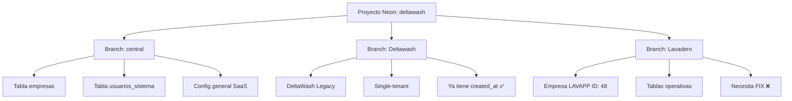

# 🔧 Plan de Corrección: Encuestas SaaS

## ✅ STATUS: IMPLEMENTADO Y VERIFICADO

**Resultado**: ✅ **FIX EXITOSO**

**Acciones Completadas**:
- ✅ Migración ejecutada en branch "Lavadero" (LAVAPP)
- ✅ Columna renombrada: `submitted_at` → `created_at`
- ✅ Reportes de encuestas funcionando sin errores en SaaS
- ✅ DeltaWash Legacy sin cambios (sigue funcionando)

**Pendiente**:
- ⏳ Actualizar `migration-sistema-encuestas-beneficios.sql` línea 32 para futuras empresas

---

## 📋 Problema Identificado

**Error**: `column sr.created_at does not exist` en reportes de encuestas SaaS

**Causa Raíz**: Inconsistencia en el nombre de columna entre migraciones Legacy vs SaaS

### Comparación de Migraciones

| Aspecto | DeltaWash Legacy | SaaS Multi-Tenant |
|---------|------------------|-------------------|
| **Archivo** | `migration-sistema-encuestas-deltawash.sql` | `migration-sistema-encuestas-beneficios.sql` |
| **Columna en survey_responses** | ✅ `created_at` | ❌ `submitted_at` |
| **Query en reportes** | Funciona (busca `sr.created_at`) | **FALLA** (busca `sr.created_at` pero no existe) |

### Código Problemático

**Archivo**: [`app/api/reportes/encuestas/route.ts`](app/api/reportes/encuestas/route.ts:26)

```sql
SELECT
    s.id,
    s.survey_token,
    s.created_at,
    s.sent_at,
    s.responded_at,
    s.client_phone,
    sr.rating,
    sr.comment,
    sr.created_at as submitted_at,  -- ❌ Esta columna no existe en SaaS
    r.marca_modelo,
    r.patente,
    r.nombre_cliente
FROM surveys s
LEFT JOIN survey_responses sr ON sr.survey_id = s.id
```

---

## 🎯 Solución Propuesta

### Opción 1: Estandarizar en `created_at` (RECOMENDADO)

**Ventajas**:
- ✅ Consistencia total entre Legacy y SaaS
- ✅ No requiere cambios en código backend
- ✅ Semánticamente correcto (`created_at` es estándar)
- ✅ Un solo cambio SQL en SaaS

**Acciones**:

1. **Crear migración fix para SaaS** (`migration-fix-encuestas-saas.sql`):
```sql
-- Renombrar columna en survey_responses para match con Legacy
ALTER TABLE survey_responses 
RENAME COLUMN submitted_at TO created_at;
```

2. **No requiere cambios de código** - Todo seguirá funcionando

---

### Opción 2: Estandarizar en `submitted_at` (NO RECOMENDADO)

**Desventajas**:
- ❌ Requiere cambio en migración Legacy (más riesgoso)
- ❌ Requiere actualizar queries en múltiples archivos
- ❌ `submitted_at` no es estándar para auditoría
- ❌ Más trabajo y más riesgo

---

### Opción 3: Adaptar el código para detectar ambas columnas (COMPLEJO)

**Desventajas**:
- ❌ Lógica duplicada en cada query
- ❌ Más complejo de mantener
- ❌ No resuelve la inconsistencia base

---

## ✅ Plan de Acción (Opción 1)

### Paso 1: Crear Migración Fix para SaaS

**Archivo**: `migration-fix-encuestas-saas.sql`

```sql
-- ============================================================================
-- MIGRATION FIX: Estandarizar columna en survey_responses
-- Fecha: 2026-02-01
-- Descripción: Renombrar submitted_at → created_at para consistencia con Legacy
-- ============================================================================

-- Solo ejecutar si la columna submitted_at existe
DO $$ 
BEGIN
    IF EXISTS (
        SELECT 1 
        FROM information_schema.columns 
        WHERE table_name = 'survey_responses' 
        AND column_name = 'submitted_at'
    ) THEN
        ALTER TABLE survey_responses 
        RENAME COLUMN submitted_at TO created_at;
        
        RAISE NOTICE 'Columna renombrada: submitted_at → created_at';
    ELSE
        RAISE NOTICE 'Columna submitted_at no existe. Migración ya aplicada o no necesaria.';
    END IF;
END $$;

-- Verificación
SELECT column_name, data_type, is_nullable, column_default
FROM information_schema.columns
WHERE table_name = 'survey_responses'
AND column_name = 'created_at';
```

### Paso 2: Aplicar Migración en Branches SaaS

**⚠️ ARQUITECTURA NEON - IMPORTANTE**

Tu proyecto tiene 3 branches con propósitos diferentes:



**Dónde Ejecutar**:

| Branch | Propósito | ¿Ejecutar migración? |
|--------|-----------|---------------------|
| **central** | BD Central (gestión de empresas) | ❌ NO - No tiene tablas `surveys` |
| **Deltawash** | DeltaWash Legacy | ❌ NO - Ya tiene `created_at` correcto |
| **Lavadero** | Empresa LAVAPP (SaaS) | ✅ **SÍ - AQUÍ ES** |

**Pasos correctos**:

1. Conectar a Neon Dashboard
2. **Seleccionar branch: "Lavadero"** ← Importante
3. Ejecutar migración `migration-fix-encuestas-saas.sql` en SQL Editor
4. Verificar resultado

### Paso 3: Actualizar Migración Base SaaS

**Archivo**: [`migration-sistema-encuestas-beneficios.sql`](migration-sistema-encuestas-beneficios.sql:32)

**Cambio**:
```sql
-- ANTES:
CREATE TABLE IF NOT EXISTS survey_responses (
  id SERIAL PRIMARY KEY,
  survey_id INTEGER NOT NULL REFERENCES surveys(id) ON DELETE CASCADE,
  rating INTEGER NOT NULL CHECK (rating >= 1 AND rating <= 5),
  comment TEXT,
  submitted_at TIMESTAMP DEFAULT CURRENT_TIMESTAMP  -- ❌ INCORRECTO
);

-- DESPUÉS:
CREATE TABLE IF NOT EXISTS survey_responses (
  id SERIAL PRIMARY KEY,
  survey_id INTEGER NOT NULL REFERENCES surveys(id) ON DELETE CASCADE,
  rating INTEGER NOT NULL CHECK (rating >= 1 AND rating <= 5),
  comment TEXT,
  created_at TIMESTAMP DEFAULT CURRENT_TIMESTAMP  -- ✅ CORRECTO
);
```

### Paso 4: Verificar Funcionalidad

**Tests a realizar en SaaS (LAVAPP)**:

1. ✅ **Ver reporte de encuestas** → No debe dar error de columna
2. ✅ **Crear encuesta** → Marcar auto como entregado
3. ✅ **Responder encuesta** → Completar desde link público
4. ✅ **Ver respuesta en reporte** → Debe aparecer con timestamp correcto

### Paso 5: Verificar que Legacy NO se rompa

**Tests a realizar en DeltaWash**:

1. ✅ **Ver reporte de encuestas** → Debe seguir funcionando
2. ✅ **Crear encuesta** → Marcar auto como entregado
3. ✅ **Responder encuesta** → Completar desde link público

---

## 📁 Archivos Afectados

### Archivos a Modificar

1. ✅ **NUEVO**: `migration-fix-encuestas-saas.sql` (crear)
2. ✅ **EDITAR**: [`migration-sistema-encuestas-beneficios.sql`](migration-sistema-encuestas-beneficios.sql:32) (línea 32)

### Archivos que NO requieren cambios

- ❌ `app/api/reportes/encuestas/route.ts` - Ya está correcto
- ❌ `app/api/survey/[token]/submit/route.ts` - No usa la columna
- ❌ `migration-sistema-encuestas-deltawash.sql` - Ya está correcto

---

## 📊 Tabla de Compatibilidad Post-Fix

| Componente | DeltaWash Legacy | SaaS (Post-Fix) | Estado |
|------------|------------------|-----------------|--------|
| **Tabla surveys** | ✅ Sin empresa_id | ✅ Con empresa_id | ✅ Compatible |
| **Tabla survey_responses** | ✅ `created_at` | ✅ `created_at` | ✅ **CONSISTENTE** |
| **Tabla benefits** | ✅ Sin empresa_id | ✅ Con empresa_id | ✅ Compatible |
| **Config** | ✅ `survey_config` | ✅ `tenant_survey_config` | ✅ Compatible |
| **APIs** | ✅ Detecta Legacy | ✅ Detecta SaaS | ✅ Compatible |

---

## 🚨 Riesgos y Mitigaciones

### Riesgo 1: Datos existentes en SaaS

**Probabilidad**: Baja (sistema recién implementado)

**Mitigación**:
- La migración usa `RENAME COLUMN` que preserva todos los datos
- No hay pérdida de información
- Operación atómica en PostgreSQL

### Riesgo 2: Queries en progreso

**Probabilidad**: Muy baja (bajo tráfico actual)

**Mitigación**:
- Ejecutar en horario de bajo uso
- La operación es instantánea (<1 segundo)
- PostgreSQL maneja locks automáticamente

---

## ⏱️ Estimación de Tiempo

| Tarea | Tiempo |
|-------|--------|
| Crear migración fix | 5 min |
| Aplicar en branch LAVAPP | 2 min |
| Verificar funcionalidad SaaS | 5 min |
| Actualizar migración base | 2 min |
| Verificar Legacy sigue funcionando | 3 min |
| Documentar resultado | 3 min |
| **TOTAL** | **20 min** |

---

## 🎯 Criterios de Éxito

1. ✅ Reporte de encuestas funciona en SaaS sin errores
2. ✅ Reporte de encuestas sigue funcionando en Legacy
3. ✅ Se puede crear, enviar y responder encuestas en SaaS
4. ✅ Migración base actualizada para futuras empresas
5. ✅ Documentación actualizada

---

## 📝 Notas Adicionales

### ¿Por qué `created_at` es mejor que `submitted_at`?

1. **Estándar de industria**: `created_at` es el nombre estándar en auditoría
2. **Consistencia con otras tablas**: Todas las tablas usan `created_at`
3. **Claridad semántica**: La fila se "crea" cuando se submite
4. **Compatibilidad con ORMs**: La mayoría esperan `created_at`

### ¿Qué pasa con encuestas ya creadas?

- Si ya hay encuestas en LAVAPP, sus timestamps se preservan intactos
- Solo cambia el nombre de la columna, no los valores
- `RENAME COLUMN` es una operación de metadata, no de datos

---

## 🔄 Próximos Pasos

### ✅ Completados

1. ✅ **Revisión del plan** → Estrategia aprobada
2. ✅ **Migración fix creada** → `migration-fix-encuestas-saas.sql`
3. ✅ **Plan documentado** → `plans/CORRECCION_ENCUESTAS_SAAS.md`

### 🚀 Pendientes de Ejecución (Requiere Code Mode)

4. ⏳ **Aplicar en SaaS** → Ejecutar `migration-fix-encuestas-saas.sql` en Neon branch LAVAPP
5. ⏳ **Verificar resultado** → Tests funcionales en SaaS
6. ⏳ **Actualizar migración base** → Editar `migration-sistema-encuestas-beneficios.sql` línea 32
7. ⏳ **Verificar Legacy** → Tests en DeltaWash para confirmar que sigue funcionando
8. ⏳ **Cerrar issue** → Documentar solución final

---

## 📌 Comandos de Verificación

### Verificar columna actual en SaaS
```sql
SELECT column_name, data_type 
FROM information_schema.columns
WHERE table_name = 'survey_responses'
ORDER BY ordinal_position;
```

### Verificar si hay datos
```sql
SELECT COUNT(*) as total_responses FROM survey_responses;
```

### Después de la migración
```sql
-- Debe retornar filas con created_at
SELECT id, survey_id, rating, created_at 
FROM survey_responses 
LIMIT 5;
```

---

## ✅ Conclusión

La solución es **simple y de bajo riesgo**: renombrar una columna en SaaS para que coincida con Legacy. Esto garantiza:

- ✅ Código unificado sin lógica condicional
- ✅ Consistencia entre ambas versiones
- ✅ Fácil mantenimiento futuro
- ✅ Sin pérdida de datos
- ✅ Operación rápida (<1 segundo)

**Recomendación**: Proceder con Opción 1 (Estandarizar en `created_at`)
